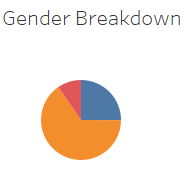
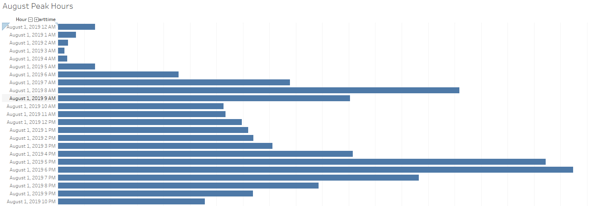
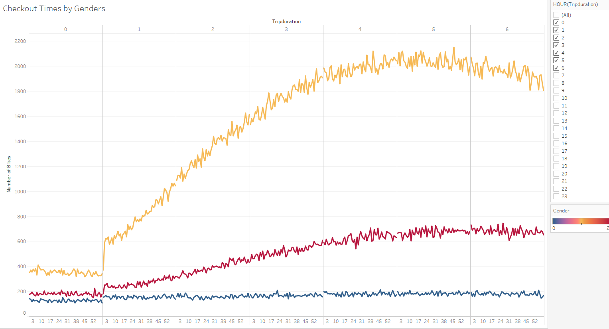
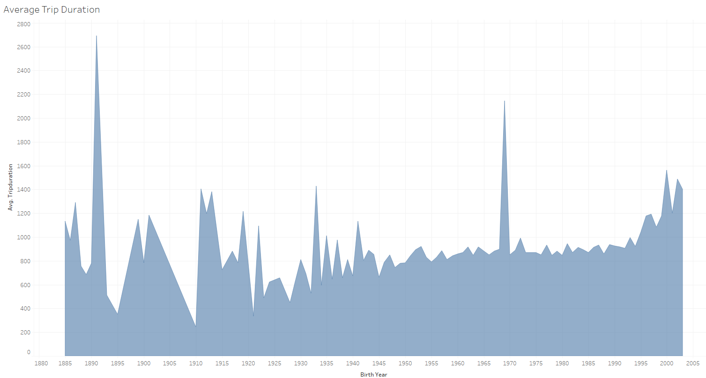
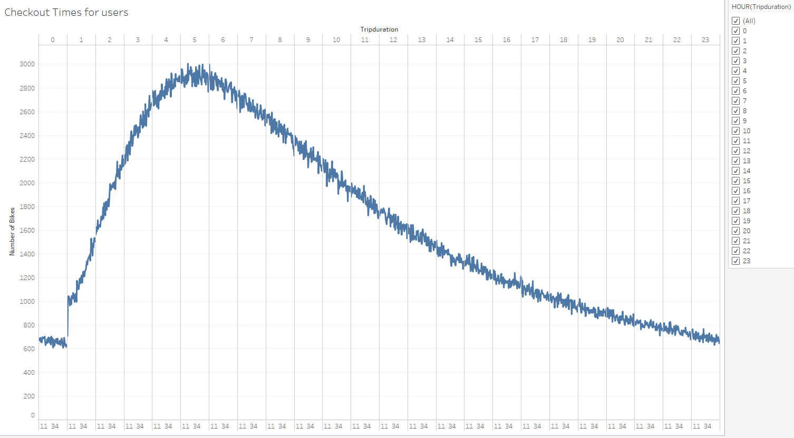
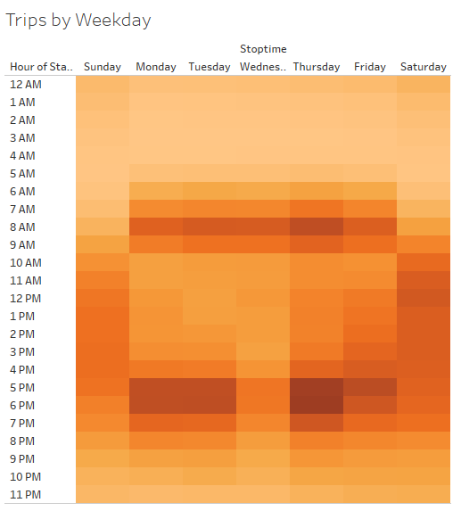
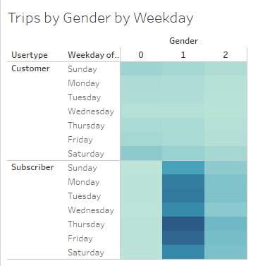

# Bikesharing Anaysis 

#Overview
For this analysis, we were tasked to use Pandas to change the "tripduration" column from an integer to a datetime datatype. Then, using the converted datatype, we created a set of visualizations to:

* Show the length of time that bikes are checked out for all riders and genders
* Show the number of bike trips for all riders and genders for each hour of each day of the week
* Show the number of bike trips for each type of user and gender for each day of the week.
Finally, you’ll add these new visualizations to our final presentation and analysis to pitch to investors.

#Analysis

* Gender Breakdown - One of the first things when analyzing out bike sharing data is who will be riding the bikes.  As with the case for the data provided to us via Citi is that the majority of riders is going to be males.

* Peak Hours - Next we were able to take a look a past month to find when the bikes had the most use by riders.  This is very valuable info because it will affect when we would want to have the highest number of bikes available but also when the down times are, so that we are able to do maintenance on the bikes.

* Checkout Times by Genders - This is a great visualization for us because this does a great job of breaking down how long each gender rides the Citi bikes.  This breakdown shows us that male riders have the widest range of bikes riden.

* Average trip Duration - In this we are able to see that typically the younger the rider is the longer they will ride.  This is not always the case as there are several expections.

* Checkout times for users - Using this graph can help us get an idea of how long wer can expect our users to ride the bikes.  As for this month the highest average ride duration was 4-6 minutes.

* Trips by Weekday - This heat map is able to give us an great idea of when riders will be using our bikes.  We see that people leaving work on M-F are the most common riders.

* Gender By Weekday - With this data we are able track how many of our rides will likely be subscribers rather than just single use customers.  We can expect for most of our rides to be subscribes who are using our bikes weekly as part of the daily commute.

* Trips By Gender(weekday per hour) - This resembles a heat map that allows for us to see when the majority of the bike rides take place.  As to be expected we notice that males ride the most likley going to and from work as the hours from 7-9AM and 4-6PM.

.PNG)

#Summary

* From the information provided by City bike in NYC we are able to get a great representation of what to expect when we roll out our bikes in Iowa.  This will help us set up a plan for when to have the most bikes available for riders, how many of our riders will be subscribers rather than single use riders, and even have an idea for how long a customer rides based off their age alone.
* One thing we will need to keep in mind is that even though we are pulling data from NYC that does not mean it is going to line up with how ours will look in Des Moines.  We will need to keep in mind that NCY is set up for people to live without vehicles on a daily basis.  This will not be the same thing in Des Moines.  It will require us to continue to monitor the data once we are able to obtain it for our city.  From there we will be able to make the necessary adjustments. 

https://public.tableau.com/profile/silas1034#!/vizhome/NCYCBAnalysisChallange/Story1?publish=yes
